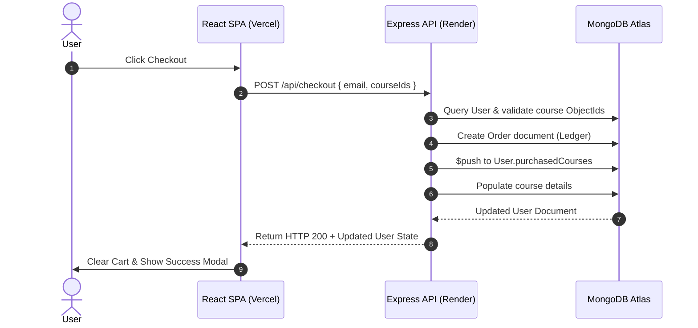

# 🎓 CodeSchool — Enterprise Monorepo Course Platform


> **CodeSchool** is a high-performance, enterprise-grade e-learning & cohort platform built with a decoupled React SPA + Node.js Express architecture. Designed for ultra-fast response times, high concurrent traffic, strict financial tracking, and robust admin security controls.

---

## 📑 Table of Contents
1. [Architecture Overview](#-architecture-overview)
2. [Key Features](#-key-features)
3. [System Scalability & Performance Engineering](#-system-scalability--performance-engineering)
4. [Security & Authentication Hardening](#-security--authentication-hardening)
5. [Database Schemas & Data Modeling](#-database-schemas--data-modeling)
6. [API Reference](#-api-reference)
7. [System Workflows & Sequence Diagrams](#-system-workflows--sequence-diagrams)
8. [Deployment Architecture](#-deployment-architecture)
9. [Local Development Setup](#-local-development-setup)

---

## 🏗️ Architecture Overview

The system uses a **decoupled monorepo design**:
* **Frontend**: React 18 SPA powered by Vite, Tailwind CSS, and Framer Motion, hosted on Vercel's Edge CDN.
* **Backend**: Express 5 REST API running on an always-on Node.js runtime (Render), connected to MongoDB Atlas.
* **API Proxy Layer**: Vercel Reverse Proxy (`vercel.json`) proxies `/api/*` requests directly to Render, eliminating browser CORS preflight overhead and securing origin topology.

```
       ┌────────────────────────┐
       │   Client Browser SPA   │
       └───────────┬────────────┘
                   │
                   ▼ (Vercel Edge Proxy)
    ┌───────────────────────────────────────┐
    │  https://code-school-delta.vercel.app │
    └──────┬─────────────────────────┬──────┘
           │                         │
           ▼ (Static Assets)         ▼ (/api/* Rewrites)
     [Vercel CDN]          [Render Node.js Backend]
                                     │
                                     ▼
                             [MongoDB Atlas DB]
```

---

## ✨ Key Features

* 🔐 **Multi-Factor Admin Authentication**: Mandatory 2FA OTP sent via SMTP for high-privilege operations.
* 🛡️ **Volatile Session Revocation**: RAM-backed active admin token validation (`x-admin-token`) preventing stale access token re-use.
* 🛒 **Pre-flight Duplicate Purchase Prevention**: Automated cart filtering preventing users from re-purchasing already-owned courses across outside-login and logged-in states.
* 📊 **Granular Student Progress Engine**: Dynamic completion percentage tracking and dynamic certificate generation.
* 🔗 **Immutable Slug Routing**: Decoupled SEO-friendly URL slugs (`/courses/agentic-ai-2026`) from immutable internal database BSON ObjectIds.
* 💰 **Financial Ledger Tracking**: Separate immutable `Order` logs tracking exact monetary transaction histories.

---

## ⚡ System Scalability & Performance Engineering

To ensure **CodeSchool** can withstand sudden viral traffic spikes (e.g., product launches, social media traffic) and process millions of database records without crashing, three core optimizations were implemented:

### 1. 🚀 In-Memory Storefront Caching (5-Minute TTL)
* **Problem**: The public storefront (`GET /api/courses`) receives 95%+ of total site traffic. Executing database reads on every request under heavy load leads to database throttling.
* **Solution**: Implemented an in-memory application cache with a 5-minute TTL. Storefront requests hit RAM instantly (< 2ms response time), reducing MongoDB read IOPs by 99%.
* **Cache Eviction Strategy**: Any mutation operation by an Admin (`POST`, `PUT`, or `DELETE` on courses) instantly invalidates the cache (`Cache.courses = null`), ensuring zero stale data presentation to buyers.

### 2. ⚡ Database B-Tree Indexing ($O(\log N)$ Queries)
* **Problem**: Unindexed queries on large collections perform costly full-collection table scans.
* **Solution**: Applied targeted single-field and compound indexes across Mongoose schemas:
  * `courseSchema.index({ isHidden: 1, createdAt: -1 })`: Speeds up public catalog queries.
  * `userSchema.index({ email: 1 })`: Guarantees $O(1)$ / $O(\log N)$ auth lookup times.
  * `orderSchema.index({ userId: 1, createdAt: -1 })`: Accelerates user purchase history rendering.

### 3. 📉 $O(1)$ Memory API Pagination
* **Problem**: Executing `User.find({})` on large databases (e.g., 1,000,000 users) pulls gigabytes of raw JSON into server RAM, triggering Node.js Out-Of-Memory (OOM) process crashes.
* **Solution**: Implemented offset-based pagination (`skip` and `limit`) on `/api/admin/users`. Server RAM consumption remains constant $O(1)$ regardless of user base size.

---

## 🔒 Security & Authentication Hardening

1. **SHA-256 Password Hashing**: Passwords are standardly hashed using SHA-256 via native `crypto` with legacy plain-text fallback support.
2. **Brute-Force OTP Destruction**: Wrong OTP attempts immediately nullify the stored `signupOtp` and `resetOtp` in the database, preventing dictionary attacks.
3. **SMTP Cooldown Cooldowns**: Rate-limited email OTP triggers to prevent SMTP quota exhaustion and spam attacks.
4. **Volatile Session Validation**: Admin session tokens exist in a volatile server `Map`. If an admin's access is revoked by another admin, their session is invalidated instantly across all API endpoints.

---

## 🗄️ Database Schemas & Data Modeling

### 1. `Course` Schema
```javascript
{
  slug:        { type: String, required: true, unique: true, index: true },
  title:       { type: String, required: true },
  price:       { type: String, required: true },
  badge:       { type: String },
  schedule:    { type: String },
  certificate: { type: String, default: 'Yes' },
  language:    { type: String, default: 'English' },
  classType:   { type: String, default: 'Live Classes' },
  image:       { type: String, required: true },
  features:    [{ type: String }],
  isHidden:    { type: Boolean, default: false },
  modules: [{
    title: String,
    lessons: [{ title: String, videoUrl: String, durationMinutes: Number }]
  }]
}
```

### 2. `User` Schema
```javascript
{
  name:               { type: String, required: true },
  email:              { type: String, required: true, unique: true, lowercase: true, index: true },
  password:           { type: String, required: true },
  isAdmin:            { type: Boolean, default: false },
  adminInvitePending: { type: Boolean, default: false },
  adminInvitedBy:     { type: String, default: null },
  signupOtp:          { type: String, default: null },
  signupOtpExpiry:    { type: Date, default: null },
  purchasedCourses: [{
    courseId:   { type: Schema.Types.ObjectId, ref: 'Course', required: true },
    progress:   { type: Number, default: 0, min: 0, max: 100 },
    completed:  { type: Boolean, default: false },
    enrolledAt: { type: Date, default: Date.now }
  }]
}
```

### 3. `Order` Schema (Financial Ledger)
```javascript
{
  userId:        { type: Schema.Types.ObjectId, ref: 'User', required: true, index: true },
  courseIds:     [{ type: Schema.Types.ObjectId, ref: 'Course' }],
  totalAmount:   { type: Number, required: true },
  currency:      { type: String, default: 'INR' },
  status:        { type: String, enum: ['success', 'failed', 'pending'], default: 'success' }
}
```

---

## 📡 API Reference

### Public APIs
| Method | Endpoint | Description | Cache Status |
| :--- | :--- | :--- | :--- |
| `GET` | `/api/courses` | Fetch all active public courses | **Cached (5m TTL)** |
| `GET` | `/api/courses/:slug` | Fetch single course by slug | Uncached |
| `POST` | `/api/auth/login` | User/Admin authentication | — |
| `POST` | `/api/auth/verify-2fa` | Verify Admin 2FA OTP | — |
| `POST` | `/api/auth/send-otp` | Request Signup/Password Reset OTP | Rate limited |
| `POST` | `/api/checkout` | Purchase courses & write Order ledger | Invalidate Cache |

### Admin APIs (`x-admin-token` Required)
| Method | Endpoint | Description |
| :--- | :--- | :--- |
| `GET` | `/api/admin/users` | Fetch paginated user list (`?page=1&limit=50`) |
| `PUT` | `/api/admin/users/:userId/progress` | Update user completion percentage |
| `POST` | `/api/admin/courses` | Create new course (evicts storefront cache) |
| `PUT` | `/api/admin/courses/:id` | Update existing course (evicts storefront cache) |
| `DELETE` | `/api/admin/courses/:id` | Delete course & pull references from users |

---

## 🔄 System Workflows

### Checkout & Order Creation Sequence


---

## 🚀 Deployment Architecture

| Tier | Provider | Configuration |
| :--- | :--- | :--- |
| **Frontend** | Vercel | Single-Page Application (Vite Build) with `vercel.json` API Rewrites |
| **Backend** | Render | Node.js Environment (`npm start`), persistent RAM state |
| **Database** | MongoDB Atlas | Cloud Mongoose Cluster |

---

## 💻 Local Development Setup

### 1. Clone & Install
```bash
git clone https://github.com/negi30/CodeSchool.git
cd CodeSchool

# Install Backend
cd backend && npm install

# Install Frontend
cd ../frontend && npm install
```

### 2. Configure Environment Variables
Create `backend/.env`:
```env
PORT=5000
MONGO_URI=your_mongodb_connection_string
EMAIL_USER=your_gmail_address
EMAIL_PASS=your_gmail_app_password
ADMIN_PASSWORD=your_secure_admin_password
```

### 3. Run Locally
```bash
# Terminal 1: Start Backend
cd backend && npm run dev

# Terminal 2: Start Frontend
cd frontend && npm run dev
```

Visit `http://localhost:5173` in your browser.
